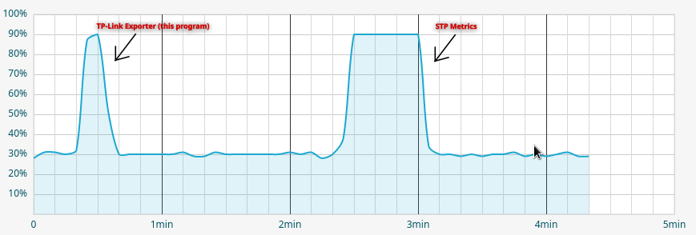

# tplink-exporter | prometheus


A tplink exporter for prometheus, written in go. Uses [ants](https://github.com/panjf2000/ants), [logrus](https://github.com/sirupsen/logrus), [godotenv](github.com/joho/godotenv), [prometheus](github.com/prometheus/client_golang)


Ants is used to create a 20 item pool of goroutines. Feel free to change that number [here](collector/collector.go#L170)

Supported/Tested Hardware & Firmware:

- T2600G = 3.0.3fw
- T1600G = 3.0.3fw

Feel free to try on other TPLink hardware, and let me know if it works!

Here is an example of CPU usage on a switch using this software vs using the built in STP metrics


- [tplink-exporter | prometheus](#tplink-exporter--prometheus)
  - [Building and Running](#building-and-running)
    - [Building from source (*nix):](#building-from-source-nix)
    - [Building docker container (*nix):](#building-docker-container-nix)
    - [docker-compose example:](#docker-compose-example)
    - [config.yaml example:](#configyaml-example)
  - [Current Metrics Exported](#current-metrics-exported)

## Building and Running

tplink-exporter can be run directly from binary or in a docker container, choose whichever method you prefer.

To be able to scan devices, the exporter expects a file named `config.yaml` in the same directory as it, with the devices ip address or dns address. If you are not comfortable with putting credentials in a yaml file, you may also use your username and password as a environment variable.

### Building from source (*nix):

```bash
cd ~
git clone https://github.com/burningsunrise/tplink-exporter.git && cd tplink-exporter
go mod tidy
GOOS=linux GOARCH=amd64 go build -o tplink-exporter .
chmod +x tplink-exporter
./tplink-exporter
```

### Building docker container (*nix):

```bash
cd ~
git clone https://github.com/burningsunrise/tplink-exporter.git && cd tplink-exporter
docker buildx build --platform linux/amd64 -t $REGISTRY.com/tplink-exporter:latest --build-arg BUILD_DATE=$(date -u +'%Y-%m-%dT%H:%M:%SZ') --push .
```

### docker-compose example:

```yaml
version: '3.9'
services:
  tplink-exporter:
    container_name: tplink-exporter
    image: $REGISTRY.com/tplink-exporter:latest
    restart: unless-stopped
    ports:
      - 9797:9797
    environment:
      - USER=${SWITCHUSER}
      - PASSWORD=${SWITCHPASS}
    volumes:
      - /home/$USER/tplink-exporter/config.yaml:/config.yaml
```

### config.yaml example:

```yaml
devices:
  - 10.1.1.2
  - myswitch.dns.lan
# May include username and password in config.yaml
# Alternatively you can use the USER and PASSWORD
# env variables, e.x.:
# export USER=username
# export PASSWORD=password
user: username
password: password

```

## Current Metrics Exported

|Name |Description|Metric |Labels |
|---|---|---|---|
|port_tx_metric| Shows tx packets on the hosts port|Tx Packet #'s| portnumber<br>host |
|port_rx_metric| Shows rx packets on the hosts port|Rx Packet #'s| portnumber<br>host |
|port_speed_metric| Shows the hosts port speed |Port speed| portnumber<br>host |
|port_vlans_metric| Shows the vlans on port number |Port numbner| vlanname<br>vlanid<br>host<br>port |
|switch_memory_metric| Shows the specific switch memory |Memory %| host<br>macaddress |
|switch_cpu_metric| Shows the specific switch cpu |Cpu %| host<br>macaddress |
|port_badrx_metric| Shows bad rx packets on the hosts port |BAD Rx Packet #'s| portnumber<br>host |
|port_badtx_metric| Shows bad tx packets on the hosts port |BAD Tx Packet #'s| portnumber<br>host |
|port_broadcastrx_metric| Shows broadcast rx packets the hosts port |Broadcast Rx #'s| portnumber<br>host |
|port_broadcasttx_metric| Shows broadcast tx packets the hosts port |Broadcast Tx #'s| portnumber<br>host |
|port_multicasttx_metric| Shows multicast tx packets on the hosts port |Multicast Tx #'s| portnumber<br>host |
|port_multicastrx_metric| Shows multicast rx packets on the hosts port |Multicast Rx #'s| portnumber<br>host |
|port_unicasttx_metric| Shows unicast tx packets on the hosts port |Unicast Tx #'s| portnumber<br>host |
|port_unicastrx_metric| Shows unicast rx packets on the hosts port |Unicast Rx #'s| portnumber<br>host |
|switch_generalinfo_metric| Shows general information about the switch with temperature as a metric |Temperature| devicelocation<br>sysdescription<br>host<br>hwversion<br>fmversion<br>macaddress<br>systime<br>runtime<br>serialnum|